# Sonora - Sistema de Gerenciamento de Músicas para Eventos

Projeto desenvolvido para a disciplina de Banco de Dados com integração entre MySQL, Python e Streamlit, utilizando dados públicos do YouTube para análise musical e apoio à gestão de eventos.

---

# Integrantes

- Ariadne Cecília Evangelista da Silva
- Arthur Phelipe de Oliveira Queiroz
- Cassio Costa Alves Domingos
- Victor Hugo Clementino da Silva
- Vitor Rayan Mendes Ribeiro


---

# Sobre o Projeto

O Sonora é uma plataforma para gerenciamento de músicas em eventos.

O sistema permite:

- Cadastro de músicas;
- Cadastro de eventos;
- Registro de pedidos musicais;
- Análise de tendências musicais;
- Integração com dados públicos do YouTube;
- Visualização de indicadores em Dashboard.

Além do gerenciamento operacional, o sistema utiliza dados reais para auxiliar na tomada de decisões sobre repertórios musicais.

---

# Objetivos

- Aplicar conceitos de modelagem de banco de dados;
- Integrar MySQL com aplicações frontend;
- Utilizar dados públicos para análise estatística;
- Implementar operações CRUD completas;
- Desenvolver dashboards para visualização de informações.

---

# Dados Utilizados

## Fonte dos Dados

Dataset:

**Global Music Hits YouTube Top 100 2025**

Disponível na plataforma Kaggle.

## Estrutura dos Dados

| Campo | Descrição |
|---------|---------|
| title | Título da música |
| channel | Canal do YouTube |
| view_count | Número de visualizações |
| duration | Duração |
| tags | Tags do vídeo |
| categories | Categoria |
| channel_follower_count | Seguidores do canal |

---

# Modelagem do Banco de Dados

## Modelo Entidade-Relacionamento

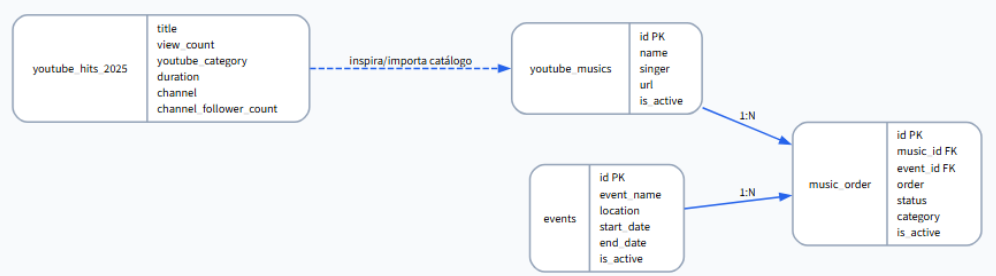

## Relacionamentos

| Relação | Cardinalidade |
|----------|----------|
| Events → Music_Order | 1:N |
| Youtube_Musics → Music_Order | 1:N |

## Tabelas

### events

Armazena os eventos cadastrados.

### youtube_musics

Catálogo de músicas.

### music_order

Pedidos musicais realizados para eventos.

### youtube_hits_2025

Dados públicos importados do YouTube.

---

# Views Criadas

## estatisticas_catalogo

Responsável pelas métricas gerais do conjunto de dados.

## top_10_musicas

Responsável por listar as dez músicas mais visualizadas.

## relatorio_musicas_eventos

Responsável por relacionar eventos, músicas e pedidos.

---

# Dashboard

## Tela Inicial

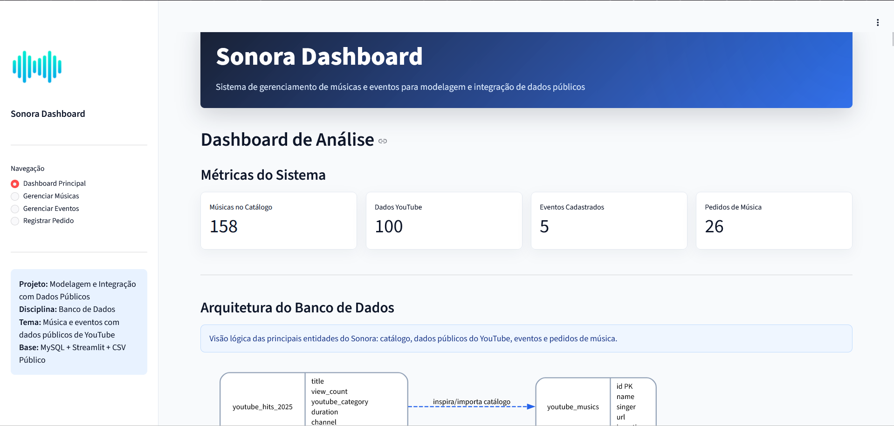

---

# Análise dos Dados

## Top 10 Músicas Mais Populares

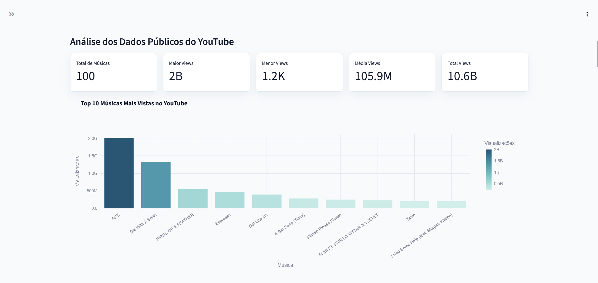

As músicas mais populares identificadas foram:

1. APT.
2. Die With A Smile
3. BIRDS OF A FEATHER
4. Espresso
5. Not Like Us

## Distribuição de Visualizações

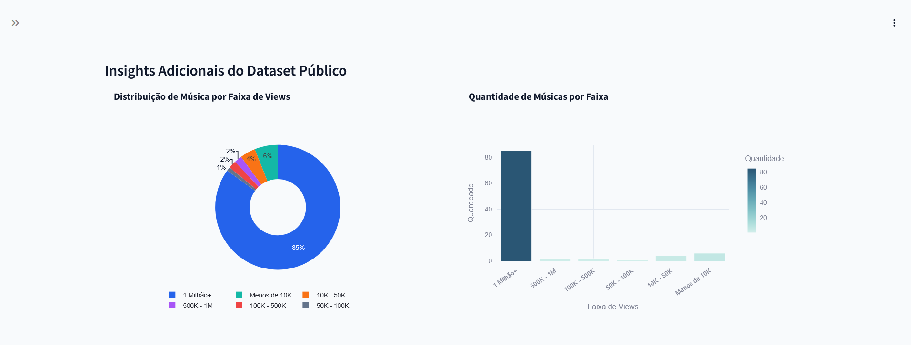

A maior parte das músicas apresenta mais de um milhão de visualizações.

## Artistas Dominantes

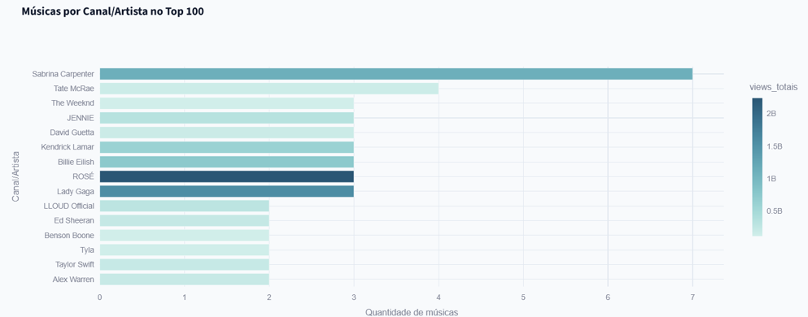

Os artistas mais recorrentes no ranking foram:

- ROSÉ;
- Lady Gaga;
- Billie Eilish;
- Sabrina Carpenter;
- Taylor Swift.

## Relação entre Duração e Popularidade e Distribuição por Gênero

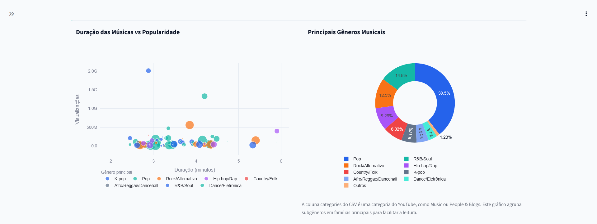

A maior concentração de visualizações ocorre em músicas com duração entre 2min30s e 4min.
O gênero Pop apresentou predominância na amostra analisada.

## Seguidores versus Visualizações

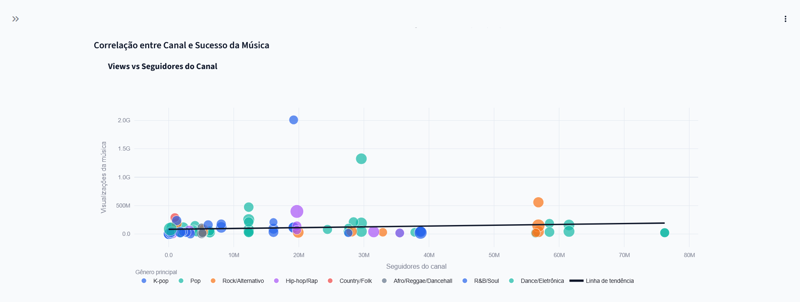

Foi observada correlação muito baixa entre número de seguidores e quantidade de visualizações.

## Colaborações versus Músicas Solo

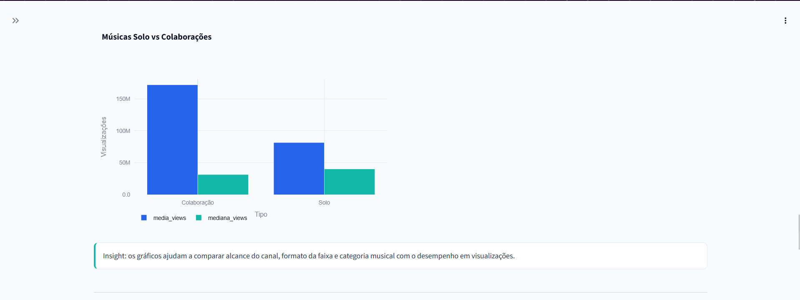

As colaborações apresentaram maior média de visualizações.

---

# Operações CRUD

## Gerenciamento de Músicas

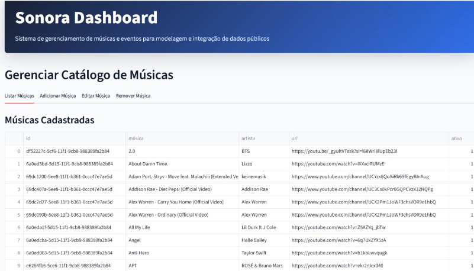

Funcionalidades:

- Inserção;
- Consulta;
- Atualização;
- Remoção.

## Gerenciamento de Eventos

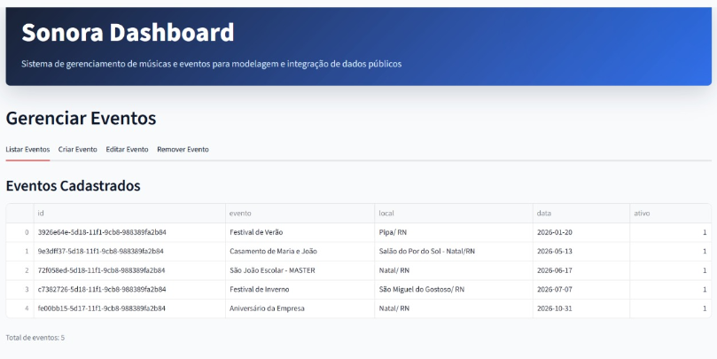

Funcionalidades:

- Inserção;
- Consulta;
- Atualização;
- Remoção.

## Registro de Pedidos

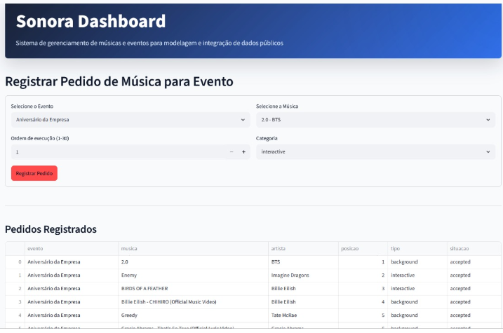

Permite associar músicas a eventos e definir características da execução.

---

# Consultas SQL Utilizadas

## Funções de Agregação

```sql
COUNT(*)
MAX(view_count)
MIN(view_count)
AVG(view_count)
SUM(view_count)
```

## JOIN

```sql
SELECT
e.event_name,
m.name,
m.singer
FROM music_order mo
JOIN events e ON mo.event_id = e.id
JOIN youtube_musics m ON mo.music_id = m.id;
```

## GROUP BY

```sql
SELECT
e.event_name,
COUNT(mo.id)
FROM music_order mo
JOIN events e ON mo.event_id = e.id
GROUP BY e.id;
```

---

# Integração entre MySQL e Dashboard

## Arquitetura da Solução

Fluxo de funcionamento:

1. O usuário interage com o dashboard;
2. O Streamlit recebe a ação;
3. O Python processa a solicitação;
4. O MySQL executa a consulta;
5. O Pandas organiza os dados;
6. O Plotly gera os gráficos;
7. O Streamlit exibe os resultados.

---

# Tecnologias Utilizadas

- Python;
- Streamlit;
- Pandas;
- Plotly;
- MySQL;
- mysql-connector-python;
- XAMPP.

---

# Como Executar o Projeto

Instale as dependências:

```bash
pip install -r requirements.txt
```

Execute o dashboard:

```bash
streamlit run dashboard_sonora.py
```

---

# Conclusão

O projeto Sonora demonstrou a aplicação prática dos conceitos de Banco de Dados e Engenharia de Software por meio da integração entre MySQL, Python e Streamlit.

Além das operações CRUD e da modelagem relacional, o uso de dados públicos possibilitou a realização de análises estatísticas relevantes sobre tendências musicais e comportamento dos usuários em eventos.

O sistema apresentou funcionamento adequado e uma arquitetura preparada para futuras expansões.

---

# Referências

Kaggle. Global Music Hits YouTube Top 100 2025.

MySQL Documentation.

Streamlit Documentation.

Plotly Documentation.

XAMPP Documentation.
